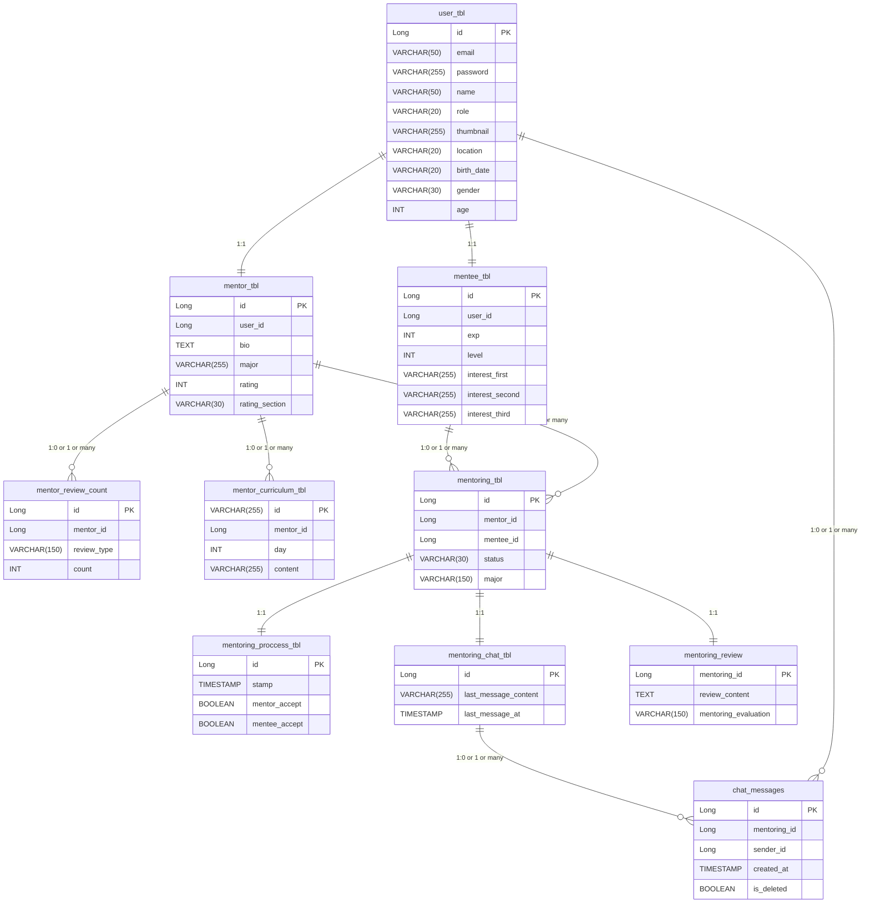
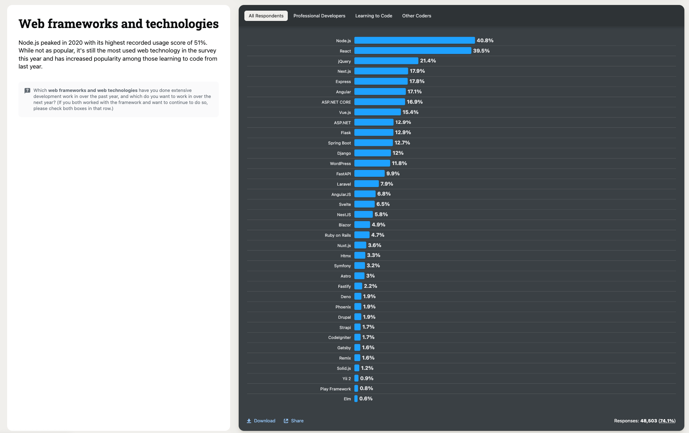
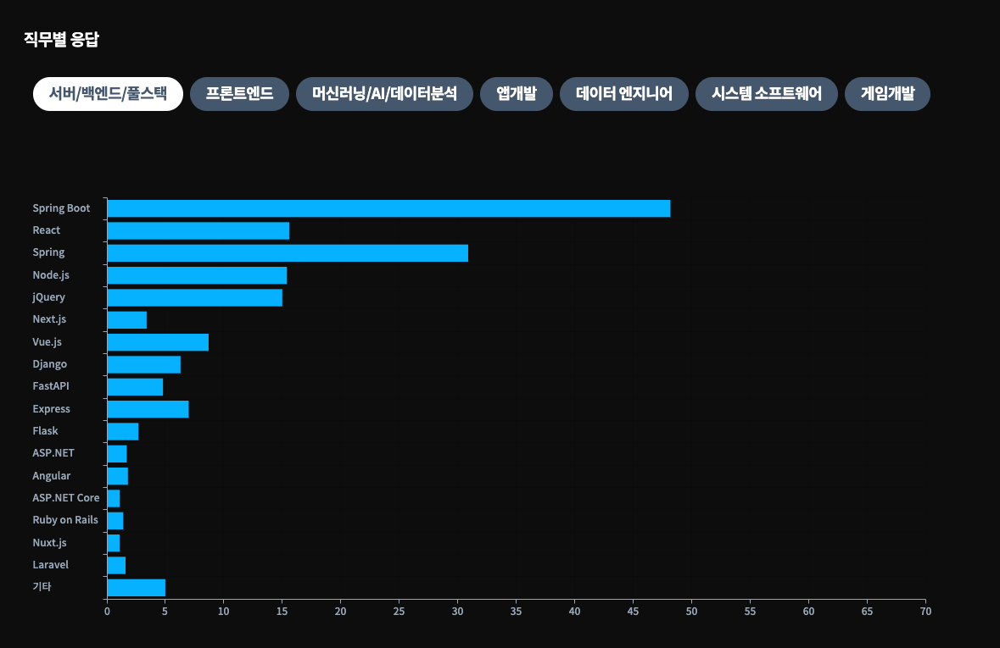

# ERD 


---
# 1학년 멘토링
이번 해커톤 8조 1학년 백엔드 친구들을 위해 몇가지 도움이 될만한 내용을 적어두었으니. 시간이 나면 한번씩 확인해 보면 좋을 것 같아

---
## 깃허브 관련
깃허브 관련 알아두면 좋은 정보

---
### 브랜치(Branch) 개념
지금 MTMT_BE 레포지토리의 브랜치 구성이 
- `main branch`
- `mentoring branch`

이렇게 구성되어있는데, branch는 나뭇가지에서 파생된 의미의 단어로, 기본 코드 베이스(주로 `main` 이나 `master`)에서, 독립된 작업이나, 프로젝트의 다른 버전을 위한 공간을 만들어내는 개념.   
branch를 생성하여 기존 코드베이스에서 변경된 작업을 진행해도, 기존 코드베이스의 변경을 주지 않고 독립된 작업을 할 수 있다.   
추후에 자신이 변경한 작업을 원래 코드베이스에 반영하고 싶으면 `merge`라는 행위를 통해 분기 되었던 branch를 통합하는 것 도 가능하다.

이번에 진행한 프로젝트를 예시로 들자면, 이번에 내가 branch를 나누었던 것은, `mentoring branch`에서는 1학년 친구들이 더 잘 이해할 수 있도록 모든 코드에 주석을 달기 위함이였고, `main branch`에서는 빠르게 구현하는 기능들을 구현하기 위해서 였어.
이렇게 나누면 추후에 `mentoring branch`를 `main branch`에 통합할 수 있겠지.

아마 추후에 프로젝트를 진행하게 되면 협업하는 팀원들과 **브랜치 전략**이라는 것을 정하게 될텐데, 주로 많은 개발자들이 사용하는 브랜치 전략은 `Git Flow`와 `GitHub Flow`가 있다.   
정리하자면 branch란 메인 코드베이스에서 분기된 작업을 독립적으로 할 수 있는 단위이고, 브랜치를 이용하면 다양한 작업을 수행할 수 있다.

---
### 커밋(Commit) 개념
커밋이란 Git에서 프로젝트의 특정 변경사항에 대한 스냅샷(SnapShot)을 찍는 작업을 의미하는데, 개발 과정에서는 코드의 수정이 빈번하고, 파일의 추가/삭제 등 여러 작업이 이루어진다.   
하지만 개발 중 특정 시점에 추가한 파일이 잘못 추가한 파일이거나, 특정 시점 이후부터의 프로그램 동작이 이상해지는 등 이러한 상황이 발생하는 경우도 종종 등장한다.   
따라서 우리는 **커밋(Commit)** 이라는 동작을 통해, 이런 상황을 방지할 수 있다.

우리가 몇몇 게임을 생각해보면, 몇몇 게임들은 죽고나면 **체크포인트**라는 곳에서 다시 시작할 수 있다. 커밋또한 이러한 체크포인트와 비슷하다.

커밋을 수행함으로써, 프로젝트의 변경사항들을 추적할 수 있고, 특정 커밋으로 다시 복구하거나 되돌리는 것이 가능하며, 협업을 통해 각자의 커밋을 올릴 수 있도록 할 수 도 있다.   

커밋은 생성시에 고유한 해시된 값, **커밋 ID**를 가지며, 커밋 ID로 위에 언급된 동작들을 할 수 있다.

예를 들어 특정 커밋으로 돌아가고 싶다면:
```bash
git revert [특정 커밋 ID]
```
이러한 명령어를 통해 특정 커밋으로 되돌아 갈 수 있다.

커밋은 최소 단위로 즉, 의미 있는 변경이 일어난 최소한의 단위로 하는 것이 바람직하다.  
하지만 그렇다고 커밋을 남발해서는 안되고, 알잘딱 재량껏 하는게 능력이다.   
이번 프로젝트를 예시로 들자면 1학년 친구들이 mentoring branch 커밋 내역을 보면 알겠지만, 너무 많은 변경사항들이 한가지 커밋에 들어가버렸음.   
따라서 이것보다는 작은 단위로 커밋을 하는게 바람직 함.

#### 커밋 규칙(Commit Convention)
이러한 커밋은 각각 커밋마다 고유한 커밋 메시지(Commit message)라는 것을 가지게 되는데, 커밋 메시지를 가독성 좋고, 이해하기 쉽게 작성하게 되면 특정 커밋에서 어떤 변경이 일어났고, 커밋의 목적이라던지 커밋의 정보를 한눈에 파악하기 쉽다.   
따라서 우리는 협업을 할때 동료들과 **커밋 규칙(Commit Convention)** 이라는 것을 정해놓고 커밋 메시지를 작성하게 된다.

더욱 자세한 정보는 [해당 글](https://dev-miyeon.tistory.com/6)을 참고하자

---


## Java 관련
Java 관련 알아두면 좋은 정보

---
### 프로그래밍 언어에 대해서
프로그래밍 언어는, 어떻게 보면 대부분 비슷하게 동작한다. 프로그래밍 언어의 목적은 컴퓨터와 소통하기 위해 컴퓨터와 인간 사이에서 인터페이스 역할을 담당하기 위한 것이 목적이기에, 결국 대부분 프로그래밍 언어의 목적은 컴퓨터와 소통하기 위한 리소스 최소화, 명확성, 빠른 속도 제공 등이 목적이다.   
따라서 내 생각엔 프로그래밍 언어를 배울때는, 먼저 한가지 언어를 깊게(여기서 말하는 깊게란 어떤 문법이 어떻게, 어떤 방식으로 컴파일(또는 인터프린팅) 되는지 까지) 공부하는 것이 좋은 것 같아.

나의 경우 나는 1학년때 백엔드를 공부하면서 Java를 조금 깊게(JVM에 자세한 동작 방식까지) 공부해보았는데, 2학년때 파이썬이나 C++을 공부할때 Java에 등장한 개념이 똑같이 등장해서 도움이 되었던 것 같아.

참고로 나는 지금 Java 개발자가 아니라서, 너네한테 Java에 대한 기술적인 도움은 크게 못줄것 같아. 그래도 기억나는거 최대한 생각해서 적어놓았어.

---
### Java 버전에 따른 변경점들
Java는 1995년 5월 23일에 썬 마이크로시스템즈에 의해서 처음 발표된 오래된 언어인 만큼, 오랜 시간동안 많은 기능이 추가되거나 삭제되었고, 기능마다 차이점이 있다.   
그중에서도 **LTS(Long-Term Support)** 라고 불리는, 오랜 시간동안 버전에 대한 안정성 있는 지원을 받을 수 있는 버전들이 특히 사용된다.   
실무에서는 주로 사용하는 Java 버전들이 정해져있는데, 그 버전들에 대해서 짧게 정리하자면   

- **Java 8(1.8)**: `Java 8` 이전 버전들은 원래 명명 규칙이 `1.X` 형식이였지만, `Java 8`을 기준으로 명명 규칙이 바뀌었다. 특히 람다 표현식, Stream API 등 많은 기능들이 추가된 버전이라, 아직까지도 해당 버전을 사용하는 회사들이 많다.   
- **Java 11**: `Java 11` 에서는 `var` 예약어(타입추론), 모듈 시스템 등 여러 기능이 생기기도 했고, OpenJDK에 대한 라이선스가 변경되며 다양한 JDK 배포판이 등장하기도 하였다.
- **Java 17(현재 프로젝트에 적용된 Java version)**: 현대 가장 많이 사용되는 LTS 버전으로, sealed class(프로젝트에 사용됨), record(프로젝트에 사용됨), 향상된-swtich 등 과 같은 유용한 기능들이 도입되어, 많은 사랑을 받는 버전이다. 나의 경우도 17을 선호함. 
- **Java 21**: 가상 스레드의 적용이 된 버전으로, 보통 이제 막 시작하는 스타트업에서 차용하는 버전이다. 나온지 아직 얼마 안되었기때문에 기존 시스템에서는 아직 마이그레이션 되진 않았다.

---
### Kotlin
Kotlin은 Jetbrains(IntelliJ 만든 회사)에서 JVM 기반 언어로 설계하였는데, 자바의 단점을 해결하면서, 자바와 100% 호환성을 가지도록 설계한 언어이다.   
보통 취업의뢰가 들어오면, Spring Boot Framework을 사용하는 회사들은 Java 언어 사용하는 회사 50%, Kotlin 50%로 구성되어서 너네가 Spring 진영으로 취업할거면 Kotlin도 꼭 알아두는 것이 중요해.    
그리고 아마 너네 주변에 백엔드 친구들도 1학년 2학기 때부터 슬슬 몇몇 친구들은 Kotlin을 공부하기 시작할거고, 2학년 1학기 때부터 진행하는 프로젝트는 80%가 Kotlin으로 하는것 같더라고.   

---

## OOP 관련
OOP 관련 알아두면 좋은 정보들

---
### OOP 등장과 현대의 사용
OOP는 기존의 프로그래밍 방식인 `절차지향 프로그래밍`의 문제점인 코드 재사용성 어려움, 유지보수 어려움 등 많은 어려움들을 해결하기 위해 등장한 프로그래밍 개발론.   
OOP는 객체라는 개념을 통해서 이러한 절차지향의 문제점들을 **캡슐화, 상속, 다형성, 추상화**와 같은 OOP의 특징들을 통해 해결하였고, 대부분 현대의 존재하는 소프트웨어(백엔드만 말하는게 아니라, 앱/웹, 등 모든 분야의)가 OOP로 개발되었다.   

Java는 100% OOP 언어이기도하고(이게 무슨 말인지 이해하려고 공부해볼 것), 대부분의 언어가 OOP를 지원하니, OOP는 개발자로써 알아두면 나쁠게 없는 개념이다.

---
### Getter와 Setter
내가 이건 멘토링하면서 한번 언급했던 포인트인데, Getter와 Setter는 개발 생산성을 증가시켜주지만, OOP의 캡슐화를 확실히 위반하는 문법이다.   
하지만 그렇다고 해서 Getter와 Setter를 **사용하지 말라는게 아니라**, 상황에 따라 적절하고 유연하게 사용해야하는것이 Getter와 Setter이다.   
간혹가다 어떤 사람들은 Setter는 무조건 지양해야한다고 하는데, 그것 또한 잘못된 발언이 될 수 있다. Setter 또한 유연하게 사용한다면 좋은 설계가 될 수 있기 때문.    

아마 이건 1학년인 너네가 당장은 이해하기 어려울 거라고 생각해, 그래서 이 내용들에 대해서 자세히 알고싶다면 아래 글들을 참고해봐. 이건 당장 공부하는건아니고, 너네가 Getter랑 Setter를 사용해가면서 "어? 이런 부분은 문제가 될 것 같은데" 하는 상황이 있을때 한번 공부해면 좋을것 같아.    

- [왜 Entity에 setter를 사용하지 말아야 할까?](https://velog.io/@langoustine/setter-%EC%A7%80%EC%96%91-%EC%9D%B4%EC%9C%A0)
- [[OOP] Getter와 Setter는 지양하는게 좋다](https://colabear754.tistory.com/173)

---
### 업캐스팅과 다운캐스팅
업캐스팅과 다운캐스팅은 OOP의 상속의 성능을 더욱 극대화 시키기 위한 일종의 문법인데, 내가 이번프로젝트에서 사용했어.     
이번 프로젝트에서 요구사항이, 멘토와 멘티에 따른 회원가입에서 받는 정보가 달라져야해서, `멘토DTO`와 `멘티DTO`가 `회원가입DTO`를 상속받도록하고, 업캐스팅과 다운캐스팅을 이용하는 코드가 `auth` 도메인에 있을텐데, 이부분을 공부해보면 좋을 것 같아.

---

## Spring Boot 관련
Spring Boot 관련 알아두면 좋은 정보

### 왜 한국에서는 Spring 진영이 압도적으로 많이 사용될까?
물론 Spring Boot Framework이 좋은 프레임워크인 것은 맞지만, 이상하게 대한민국에서 점유율이 엄청나게 높다. 아래 그래프를 보자





전세계 웹 프레임워크 점유율에서 Spring Boot는 약 `12.4%`에 해당하는데, 대한민국의 경우 Spring Boot가 `48.2%`이고, Spring이 `30.9%`, 둘이 합치면 약 `78.2%`만 Spring 생태계인것을 알 수 있다(단, 대한민국 설문의 경우 최대 2개 선택이므로 백분율 안맞음).

이렇게 된 가장 큰 이유는, 대한민국의 공공 기관 시스템은 '전자정부 표준 프레임워크'를 기반으로 구축되는 경우가 매우 많은데, 이 표준 프레임워크는 2000년대 중후반, 복잡한 J2EE(Java 2 Platform, Enterprise Edition) 환경의 대안으로 Spring Framework를 핵심 기술 스택으로 채택하였고,    
공기업 및 은행권 기업들은 이 전자정부프레임워크를 따르는 것이 원칙이였기 때문에, 대한민국의 많은 백엔드 애플리케이션이 Spring 생태계에 자연스럽게 참여할 수 밖에 없었다.  

이러한 복합적인 이유들로 인해 한국 IT 시장에서는 Spring Boot가 여전히 강력한 지위를 유지하며 많은 프로젝트에서 선택되고 있다.

그래서 1학년 친구들인 너네가 취업을 백엔드로 하고싶으면 Spring 진영으로 하는게 제일 좋다고 생각하고, 너네가 더 배우고 싶은 다른 프레임워크나 기술스택이 있으면, Spring을 그래도 어느정도 공부한 다음에 배우기 시작하는 걸 추천할게. 나는 그렇게 했었어. 그리고 다른 기술스택을 주 기술스택으로 하게되면 다른 친구들이랑 프로젝트 하는데 참여하기 어렵고, Entry나 JOBIS 같은 동아리에 들어가기도 힘들꺼야.

---
### IntelliJ 100% 활용하기
Spring Boot 이야기는 아니지만, 보통 Spring Boot 프로젝트를 개발할때 IntelliJ를 활용할텐데, IDE도 사용자의 숙련도에 따라서 개발 효율성이 다 달라지거든, 그래서 IntelliJ를 잘 활용할 수 있는 방법들을 찾아봐봐.     
예시로는 IntelliJ에서 제공하는 Git GUI, Debugging Tool 등이 있을 수 있겠지.

---
### Spring Security
Spring Security를 잘 활용하는 것이 중요해. 대부분의 프로젝트에서는 사용자 로그인/회원가입 기능은 거의 없는 경우가 없기도 하고, Spring Security는 기본적으로 알아두면 좋아. 내가 이번 프로젝트에서 Spring Security를 적극적으로 활용하는 방향으로 코드를 짰으니 확인해보면 좋을 것 같아.

---
## DB 관련
DB 관련 알아두면 좋은 팁들

---
### 백엔드 개발자에게 DB란
나는 백엔드 개발자에게 DB는 CS 지식중 가장 중요한 지식이라고 생각해. 백엔드라는 분야가 DB 시스템과 가장 잘 엉켜있기도 하고, 몇몇 기업들(특히 스타트업)에서는 백엔드 개발자가 DBA 대신에 DB를 관리하는 경우도 더러 있거든, 그래서 DB에 대해서 알아두면 좋을 것 같아.

특히 백엔드 개발자 채용 공고에 보면 SQLD 자격증을 요구하는 경우가 많은데, 나중에 시간날때 한번 찾아보면 좋을 것 같아.

---
### ERD
ERD 설계하는 방법은 내가 그때 알려준 것 처럼 프로젝트 기능이랑 요구사항, 디자인을 보면서 설계하면 돼. 사실 나도 ERD 설계하는 방법은 잘 몰라서 딱히 해줄말이 더 없다.     
그때 보여준것 처럼 ERDCloud 같은 도구 이용해서 당근 마켓이나 배달의 민족 같은 시스템의 Backend 시스템은 어떻게 되어있을까 고민해보면서 ERD 클론 설계 해봐도 좋은 연습이 될 것 같아.

---
## 의외 사소한 팁들
의외 사소한 팁들

- 너네가 앞으로 개발자를 선택했으면, 여러가지 코드 짜는 방식이나 설계를 많이 마주하게 될텐데, 한 가지 설계나, 코드 스타일을 **바이블(Bible)** 처럼 생각하고 무조건 그런 설계나 방식으로만 개발하는 것은 좋지않아. 프로그래밍 세계에는 다양한 답들이 존재할 뿐이지, 무조건적인 정답은 없어.
내 코드도 정답이 아니니까 내 코드를 볼때 "아 그냥 이런 방식도 있구나" 하고 넘겼으면 좋겠어.
- 나는 한가지 전공에 매몰되면 좋지 않다고 생각해, 예를 들어 너네가 백엔드라고 해서 백엔드만 다룰 수 있는 것이 아니라, 백엔드를 중심으로 클라이언트에 대한 지식 조금, 운영에 대한 지식 조금을 알고있는 것처럼 여러 분야에 대해서 알고있으면 좋을 것 같아.
**단, 이건 나의 의견일 뿐이니까 신경쓰지 않아도 괜찮아**
- 공부에 순서는 없어, 그니까 모든 공부는 너네 필요에 의해서 하면 돼, 예를들어 너네가 백엔드 개발을 하고싶으면 굳이 언어부터 배워야하는게 아니야. 너네가 백엔드 개발을 하고싶어서 찾아봤더니 Spring Boot라는 Framework를 알야아한다고 나오면, Spring Boot를 공부하면 돼.
그런데 Spring Boot는 Java로 구성됬는데, 너네가 Java에 대해서 모를때, 그때 Java 먼저 공부해야하는거지. 그러니까 필요성에 의해서 순서가 생기는거지, 공부에 정해져있는 순서가 있는건 아니야.

---
## PS
너네가 앞으로 뭘 해야할지 모르겠으면, 이 프로젝트를 너네가 이어서 해봐도 좋을 것 같아. 지금은 간단한 회원가입 로그인만 구현되어있는데, 우리 8조에서 이번에 진행한 프로젝트가 기술이 굉장히 많이 들어갔거든, 나는 시간이 없어서 JS + Express로 개발했는데, Spring으로도 개발해보면 좋은 경험이 될 것 같아.
예를들어 우리 요구 기능중에 채팅이 있는데, 채팅을 구현하려면 **Socket** 이라는 기술을 알아야 하거든. 

지금 너네 1학년 백엔드가 두명이니까 둘이 상의해서 같이 협업을 해도 좋고, 아니면 둘이 스케줄이 안맞으면 브랜치 각자파서 개발해봐도 좋을 것 같아. 

지금 둘다 Figma 초대 되어있고, 노션 초대되어있으니까 그거 봐가면서 해도 좋을 것 같아.

혹시나 나중에 코드 리뷰 요청하면 코드리뷰도 해줄테니까 [bhyun08@dsm.hs.kr](bhyun08@dsm.hs.kr)에 이메일 남겨주면 좋을 것 같아. (바쁘면 못해줄 수 도 있어)

혹시 무슨 기능 있는지 모를까봐 기능도 남겨놓을게

- 멘토 회원가입
- 멘티 회원가입
- 로그인
- accessToken 갱신
- 본인 프로필 조회
- 본인 프로필 수정
- 본인 멘토일때 정보 수정
- 본인 멘티일때 정보 수정
- 멘토 `<>` 멘티 전환
- 홈 화면(멘티면 분야별 멘토를 커서 기법으로 불러옴, 멘토면 멘티를 커서 기법으로 불러옴)
- 커리큘럼 생성(멘토 전용)
- 커리큘럼 수정(멘토 전용)
- 내 커리큘럼 조회(멘토 전용)
- 커리큘럼 삭제
- 특정 멘토에게 멘토링 신청(멘티 전용)
- 멘토링 요청 목록 조회(멘토 전용)
- 멘토링 요청 승인 및 거절 관리(멘토 전용)
- 멘토링 종료(멘토 멘티 둘다)
- 멘토링 리뷰 작성
- 멘토 매칭 추천(멘티 전용)
- 특정 멘토 프로필 조회
- 멘토링 리뷰 작성
- 멘토-멘티 채팅(Socket)
- 채팅 내역 조회
- 채팅방 목록 조회 
